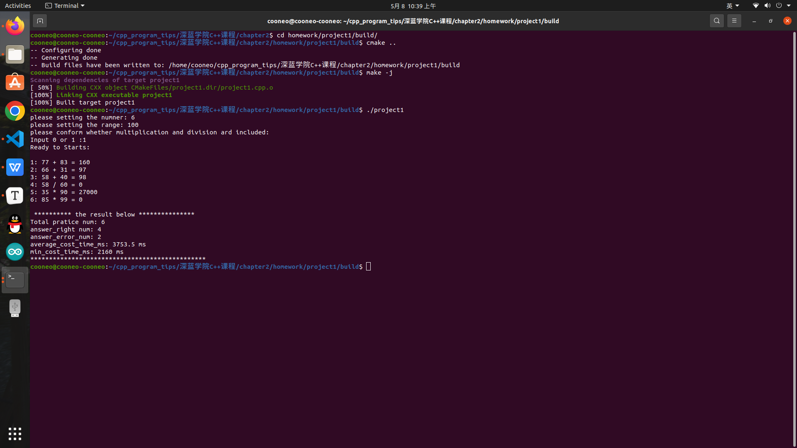

# 1.功能说明

这部分简单介绍你的核心功能函数和功能逻辑，你可以着重说一下你觉得自己做的好的/困难的部分。

​	描述：1、 主要是 需要考虑到根据用户的输入参数，决定使用那几种运算符号“+-*/”。为了能够随机地产生数字以及随机地产生运算符，使用C++ 中的随机数库，并使用时间作为了随机数算子；

​				2、为了记录用户的答题时间，这里使用 linux 中的sys/time.h 库文件，通过查询系统时间，计算答题前、答题后时间差；

​				3、输出，定义了几个变量（答题正确、错误数量、最短答题时间、平均答题时间）来记录答题的相关信息，最后在答题完毕之后，作为输出内容。


Func1 负责处理用户输入

```c++
    
//用户交互 设置计算参数
    std::cout<<"please setting the numner: ";
    std::cin>>calculate_num;
    
    std::cout<<"please setting the range: ";
    std::cin>>range;

    std::cout<<"please conform whether multiplication and division ard included: \nInput 0 or 1 :";
    std::cin>>multi_divi_flag;
```


Func2 负责计算

```C++
while( i < calculate_num ) 
    {
        // 获取两个随机数
        num1 = random() % range ;
        num2 = random() % range ;
        
        // 随机选择运算符号，并计算运算结果
        switch( ( random() % state_num ) )
        {
            case 0:
                real_sum = num1 + num2 ;
                std::cout<<i+1<<": "<<num1 <<" + "<<num2<<" = ";
                break;
            case 1:
                real_sum = num1 - num2 ;
                std::cout<<i+1<<": "<<num1 <<" - "<<num2<<" = ";
                break;
            case 2:
                real_sum = num1 * num2 ;
                std::cout<<i+1<<": "<<num1 <<" * "<<num2<<" = ";
                break;
            case 3:
                real_sum = num1 / num2  ;
                std::cout<<i+1<<": "<<num1 <<" / "<<num2<<" = ";
                break;
            default:
                break;
        }

        // 记录 答题开始的时间
        gettimeofday(&tv,NULL);
        begin_time_ms = tv.tv_sec * 1000 + tv.tv_usec / 1000 ;  // ms
        //等待用户的输入结果：
        std::cin>>client_sum ;
        
        // 计算答题耗费时间
        gettimeofday(&tv,NULL);
        curr_cost_time_ms = ( tv.tv_sec * 1000 + tv.tv_usec / 1000 ) - begin_time_ms ;
        
        // 记录有史以来最短答题时间 ;
        if( min_cost_time_ms > curr_cost_time_ms ){ min_cost_time_ms = curr_cost_time_ms ; }
        
        // 计算累计答题时间
        average_cost_time += curr_cost_time_ms ; 

        // 记录答题正确和错误的数量
        if(client_sum == real_sum ) { answer_right_num ++ ; }
        else { answer_error_num ++ ; }

        i ++ ;
    }
```


Func3 负责打印输出

```c++
    // 统计结果，向终端打印输出。
    average_cost_time /= calculate_num ; 
    std::cout<<"\n ********** the result below *************** \n"
             <<"Total pratice num: "<<calculate_num<<"\n"
             <<"answer_right num: "<<answer_right_num<<"\n"
             <<"answer_error_num: "<<answer_error_num<<"\n"
             <<"average_cost_time_ms: "<<average_cost_time<<" ms"<<"\n"
             <<"min_cost_time_ms: "<<min_cost_time_ms<<" ms"<<"\n"
             <<"*********************************************** "<<std::endl ;
   
```


# 2.运行方式

​	使用的是 ubuntu20.04 OS + Cmake 编译方法，运行代码流程如下：

​	

```bash
cd .... homework/project1/build/
cmake ..
make -j

# run
./project1 
```


整个过程：

