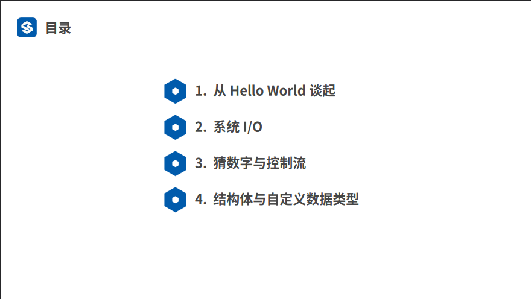
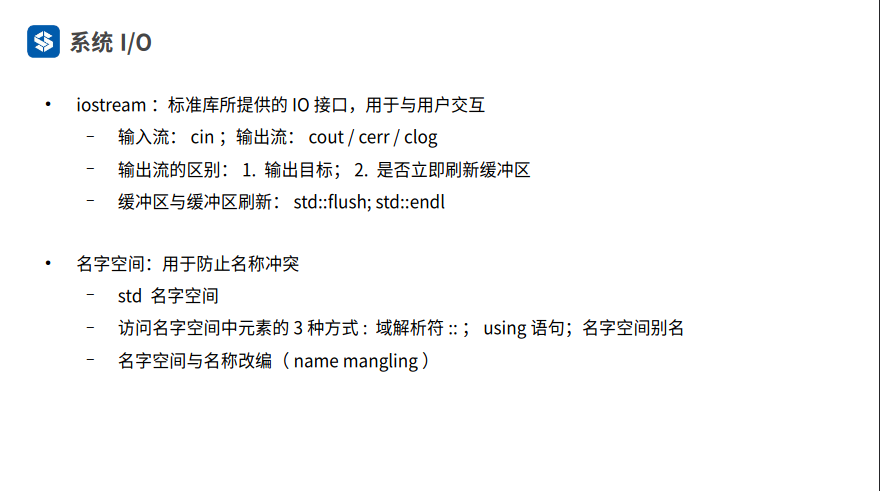
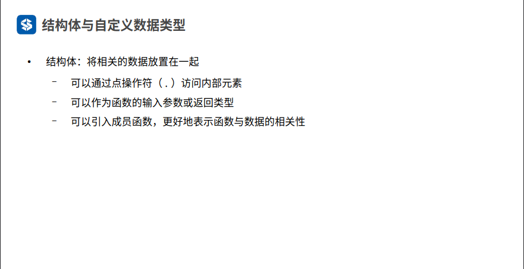
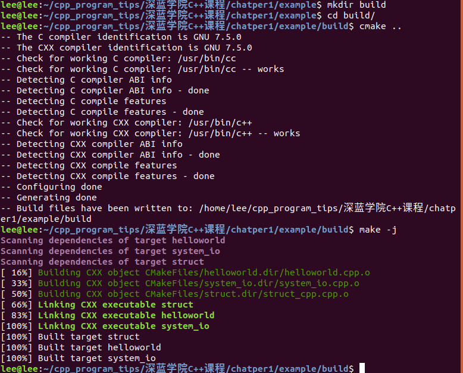
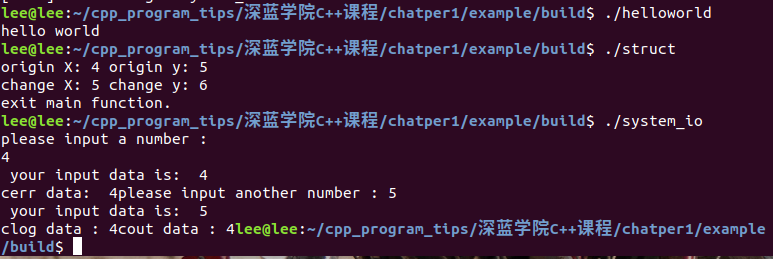

# chapter 1  C++ 初探



## 1、hello world 

## 2、系统IO



```c++
/*******************   输乳流: cin  *****************************************
 *  用法：先定义一个变量 a ，然后使用 cin  指向这个变量，最后程序运行的时候，
 *  就会提示您输入一个数字给该变量赋值：
 *  如： cin >> a ;
**************************************************************************/

/********************** 输出流: cout / cerr / clog ****************************
 *     std::cout 标准输出流，可以被重定向.
 *     std::cerr 标准错误输出流  对应与C 语言中的 stderr ，用于显示错误信息，其会立即刷新缓冲区，无需等待缓冲区满，因此比较可以及时地输出一些关键信息
 *     std::clog  标准日志输出流 ，其不会及时刷新缓冲区，因此当程序意外终止的时候，可能来不及想屏幕或者重定向文件输出 日志 log.
 *
 *************************************************************************/

/*******************  主动刷新 输入缓冲区 : std::flush / std::endl ****************************
 * 
 *     std::flush :  强制刷新缓冲区 ，
 *  
 *     std::endl： 换行 + 强制刷新缓冲区 ，
 * 
 ****************************************************************************************/

```


## 3、结构体



```c++
#include <iostream>

// 结构体通常使用  .  操作符号来访问该元素 。 
// c++ 之中，结构体也是可以引入 函数的，如下所示：
struct Point{
    int x;
    int y;
    void change_x()
    {
        x = x + 1 ;
        y = y + 1 ;
    }
};

int main()
{
    Point P;
    P.x = 4 ;
    P.y = 5 ;
    std::cout<< "origin X: "<<P.x << " origin y: "<<P.y << std::endl;
    P.change_x();

    std::cout<<"change X: "<<P.x<< " change y: "<<P.y<<std::endl;
    std::cout<<"exit main function. "<<std::endl;
    return 0;
}
```


## 编译方法：



```bash
# 打开终端
cd 进入 ............/cpp_program_tips/深蓝学院C++课程/chatper1/example
mkdir build 
cd build
cmake ..
make -j

# 分别运行 .
./helloworld
./struct 
./system_io
```


